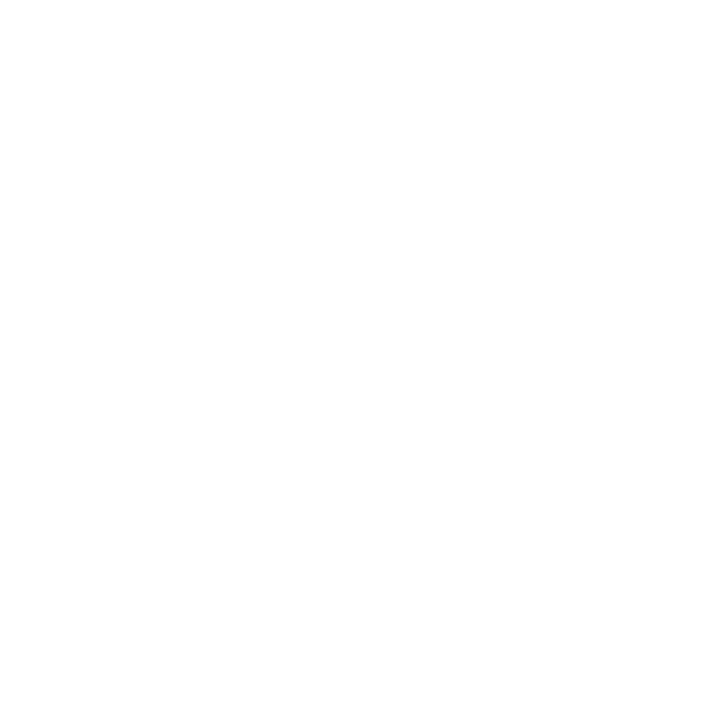

# 🎓 Adam Asmaca - Eğitim (Hangman for Education)

  
  
<b>Eğlenerek öğrenmenin en modern, en rekabetçi ve en kolay yolu!</b>

Adam Asmaca Eğitim, **MEB müfredatıyla (1. sınıftan 12. sınıfa kadar ve KPSS gibi sınavlara) uyumlu**, tamamen oyunlaştırılmış (gamified) bir **Eğitim Platformudur**. Klasik adam asmaca oyununu modern ve "premium" web teknolojileriyle harmanlayarak öğrencilerin oyun oynarken kelime haznelerini geliştirmesini ve okul derslerini tekrar etmesini sağlar. 

## 🚀 Öne Çıkan Süper Özellikler

### 🎮 Eğlenceli ve Oyunlaştırılmış Deneyim
- **Müfredat Uyumu:** Kendi sınıfınızı ve dersinizi seçin! Sistem o ay işlemeniz gereken üniteyi **"Şu Anki Ünite"** olarak otomatik parlatır.
- **Dinamik Zorluk Seviyesi:** İlkokul grupları için daha kolay (uzun hata payı), lise ve sınav grupları için ise daha kısıtlı hata payı ile zorluk dinamik olarak uyarlanır!
- **Rozet Sistemi (Gamification):** Kelimeleri arka arkaya doğru bildikçe *Seri Başlangıcı*, *Kusursuz Zafer*, *Kelime Avcısı* gibi gösterişli rozetler kazanırsınız. Rozetlerinizi kazandıkça Bronz, Gümüş, Altın, Elmas seviyelerine yükseltin!
- **Akıllı Hata Defteri:** Bilemediğiniz tüm kelimeler sisteme kaydedilir. Yeterince hata biriktiğinde (örn. 10 kelime) sistem size bu kelimeleri tekrar çözdürerek eksiklerinizi tamamlar! (Üstelik kopyayı önlemek için kelimeler sansürlü şekilde saklanır).
- **Jokerler:** Puanlarınızla "Harf Göster" veya "Harf Ele" jokerleri satın alabilirsiniz.

### 🏫 Gelişmiş Öğretmen ve Sınıf Paneli
- **Sınıf Oluşturma:** Öğretmenler saniyeler içinde kendilerine özel dijital sınıflar açabilirler.
- **Öğrenci Takibi & Liderlik Tablosu (Leaderboard):** Öğrenciler otomatik üretilen sınıf koduyla sınıfa katılır; öğretmenler ise kendi sınıfları içindeki amansız rekabeti **Sıralama (Puan Tablosu)** üzerinden canlı canlı izleyebilir.
- **Özel Kelime Havuzu:** Öğretmenler kendi hazırladıkları sınav veya kelime listelerini sadece kendi sınıflarındaki öğrencilere çözdürebilirler!

### 📱 Çapraz Platform: Web, Android, PWA!
- **Capacitor Entegrasyonu:** Bu proje sadece web'de çalışmakla kalmaz; **Capacitor** altyapısıyla tek komutla harika bir **Android** uygulamasına (APK/AAB) dönüşür!
- **PWA (Progressive Web App):** İsteyen kullanıcılar web tarayıcısı üzerinden tek tıkla uygulamayı telefonuna veya bilgisayarına indirebilir. 

---

## 🛠️ Modern Teknoloji Yığını (Tech Stack)

Uygulamanın gücü, karmaşık kütüphanelere bağımlı olmamasından ve modern teknolojilerin saf halinden gelir:

* **UI / UX (Frontend):** 
  * Saf **HTML5** ve **Vanilla JavaScript (ES6+)** ile devasa hız. React vb. framework yükü yok!
  * **Vanilla CSS:** Şık Glassmorphism efektleri, esnek Grid/Flex yapıları, pürüzsüz animasyonlar (micro-interactions) ve karanlık (Dark) tema.
* **Backend & Veritabanı:**
  * **Firebase Auth:** Google hesabı ile tek tıkla güvenli giriş (veya misafir modu).
  * **Cloud Firestore:** Kullanıcı istatistiklerinin, sınıfların, öğretmen kelimelerinin ve skor tablolarının anlık (real-time) senkronizasyonu.
* **Mobil Altyapı:**
  * **Ionic Capacitor:** Web uygulamasını kusursuz çalışan bir Android Native uygulaması haline getirir.
* **Data Mühendisliği (Data Scripts):**
  * Proje içindeki özel **Python betikleri**, karmaşık ve çoklu sınıf/müfredat dosyalarını tek bir tıkla analiz eder, eksiklikleri tespit eder, optimize eder ve uygulamaya anında sunar!

---

## 🧑‍💻 Geliştirici
Bu proje, kodlamaya tutkuyla bağlı ve eğitime teknolojiyle değer katmayı hedefleyen [turkerpro](https://github.com/turkerpro) tarafından geliştirilmiştir.

*Eğitimde ezberi kırıp, rekabetle öğrenmenin tadını çıkarın!*
